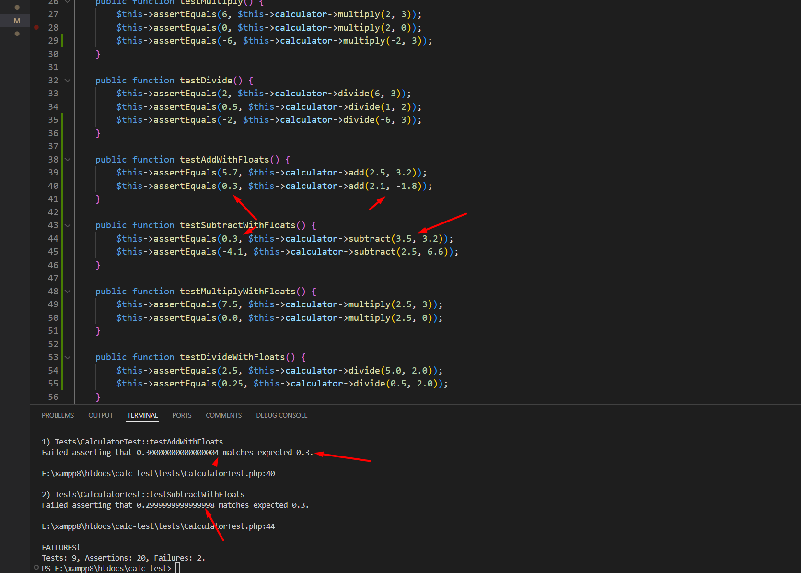

# Calculator Unit-Test init

## Req

- PHP >= 7.4
- Composer
- PHPUnit 

## install 

composer require --dev phpunit/phpunit
composer dump-autoload
vendor/bin/phpunit tests/CalculatorTest.php

## Test Results

