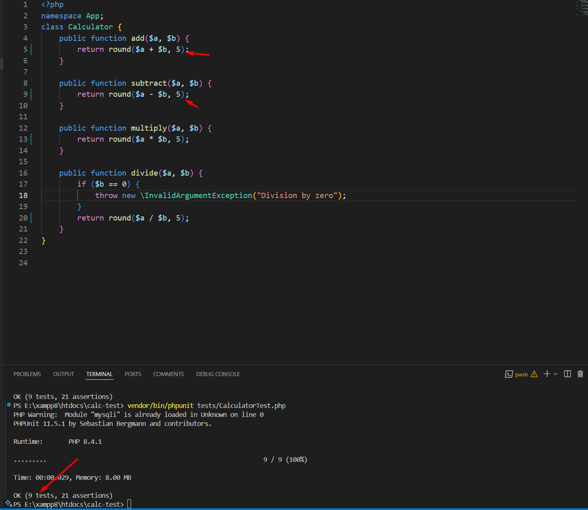

# Calculator Unit-Test init

## Description

This project is a simple calculator application designed to demonstrate unit testing in PHP using PHPUnit. It includes basic arithmetic operations and corresponding unit tests to ensure the correctness of the implementation.

## Requirements

- PHP >= 7.4
- Composer for dependency management
- PHPUnit for running unit tests

## install 

```bash
composer require --dev phpunit/phpunit
composer dump-autoload
vendor/bin/phpunit tests/CalculatorTest.php
```

## Test Results


